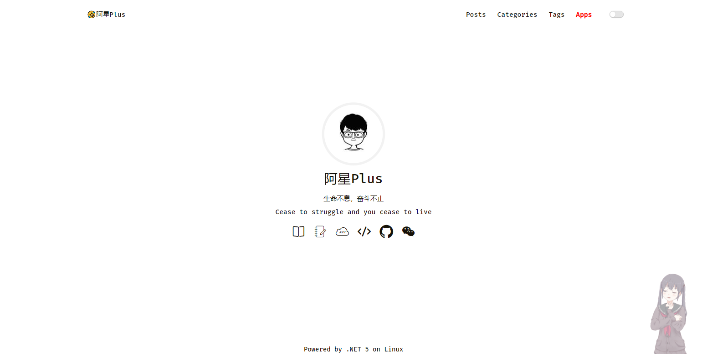
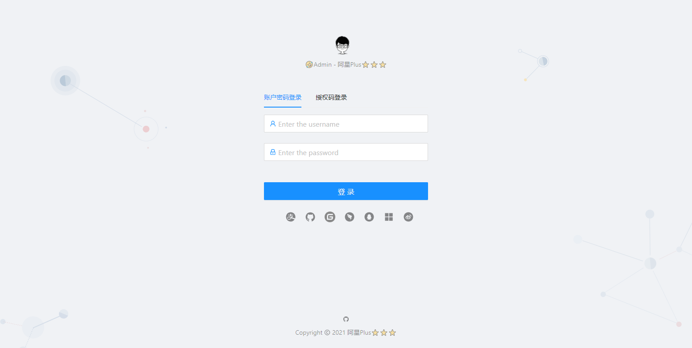
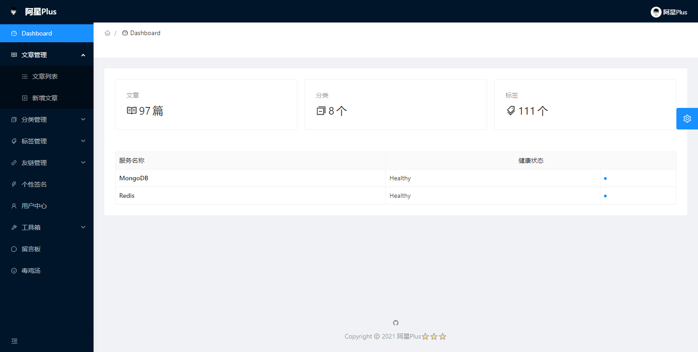
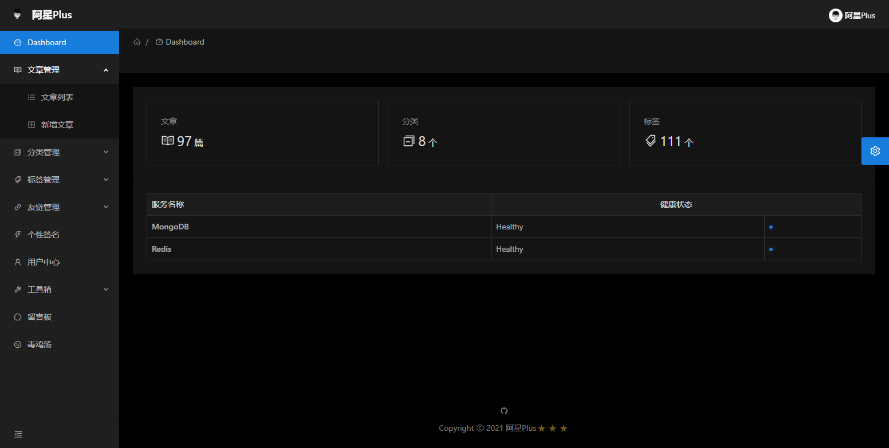
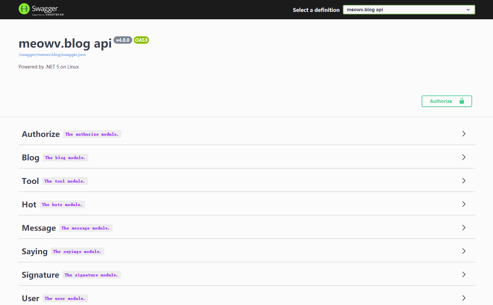

# 🤣阿星Plus⭐⭐⭐ 个人博客

## 项目介绍

本项目有不同开发版本，最新版底层基于 [abp vNext](http://abp.io) 搭建和免费开源跨平台框架 [.NET5](https://dot.net) 进行开发，使用 MongoDB 存储数据，Redis 缓存数据。项目采用前后端分离的模式进行开发，API 遵循 RESTful 接口规范，页面使用 [Blazor](http://blazor.net) 进行开发，可作为 .NET Core 入门项目进行学习。

**注：历史版本，请切换不同分支查看。**

If you liked `Blog` project or if it helped you, please give a star ⭐️ for this repository. 👍👍👍

## 预览体验

### Web项目：[https://meowv.com](https://meowv.com)




### Admin项目：[https://admin.meowv.com](https://admin.meowv.com)







### Api项目：[https://api.meowv.com](https://api.meowv.com)



## [文章介绍](https://docs.meowv.com/aspnetcore/abp-blog/)

1. **[使用 abp cli 搭建项目](https://mp.weixin.qq.com/s/3Sc4Z2xkLdQNErvXf92B9A)**
2. **[给项目瘦身，让它跑起来](https://mp.weixin.qq.com/s/oc96GG2sxz0J_vT6sReojQ)**
3. **[完善与美化，Swagger登场](https://mp.weixin.qq.com/s/usz1BRYzBO2tT_z9MaonPg)**
4. **[数据访问和代码优先](https://mp.weixin.qq.com/s/OHBW24PSNIeOARnHlbWBNQ)**
5. **[自定义仓储之增删改查](https://mp.weixin.qq.com/s/ObgAtdWe3-nZw6hWC5dhyg)**
6. **[统一规范API，包装返回模型](https://mp.weixin.qq.com/s/uVsFiKjbiHX5lKAhuZ2E9g)**
7. **[再说Swagger，分组、描述、小绿锁](https://mp.weixin.qq.com/s/cNB469s18plbCLbHxL1QUA)**
8. **[接入GitHub，用JWT保护你的API](https://mp.weixin.qq.com/s/ZOX9D4ncqqeXxipYapTeBA)**
9. **[异常处理和日志记录](https://mp.weixin.qq.com/s/segjYoh1rMI372PKi-ap6w)**
10. **[使用Redis缓存数据](https://mp.weixin.qq.com/s/fTqDnwVUgqKnwz21AsETGA)**
11. **[集成Hangfire实现定时任务处理](https://mp.weixin.qq.com/s/wRITvM72JveP7ozx2tDL4A)**
12. **[用AutoMapper搞定对象映射](https://mp.weixin.qq.com/s/VO0qKlOg90kb27XGcpGjqw)**
13. **[定时任务最佳实战（一）](https://mp.weixin.qq.com/s/DkGuy4jJ629ARh5gMq5I_Q)**
14. **[定时任务最佳实战（二）](https://mp.weixin.qq.com/s/vGg14QchfUjNcNuOBfw7Tg)**
15. **[定时任务最佳实战（三）](https://mp.weixin.qq.com/s/rFvsLuqZtdUnkqxRhN29rw)**
16. **[博客接口实战篇（一）](https://mp.weixin.qq.com/s/5tTMKfZvXvi1Z7NJ3yZdvg)**
17. **[博客接口实战篇（二）](https://mp.weixin.qq.com/s/2nmw2td01cEhqBCc32FUYw)**
18. **[博客接口实战篇（三）](https://mp.weixin.qq.com/s/B0AwLunJ6xSqJzXwE_qJSg)**
19. **[博客接口实战篇（四）](https://mp.weixin.qq.com/s/3V7Q-RvaxEiopXR73YpG5Q)**
20. **[博客接口实战篇（五）](https://mp.weixin.qq.com/s/B3jvHCtKotmmlcAKYxL9Lw)**
21. **[Blazor 实战系列（一）](https://mp.weixin.qq.com/s/gtnZ74ItGmocpxDcOVswng)**
22. **[Blazor 实战系列（二）](https://mp.weixin.qq.com/s/RVX94RPnEteHouz_0BDayw)**
23. **[Blazor 实战系列（三）](https://mp.weixin.qq.com/s/9pC456tnmjJNMS55aEe9Qg)**
24. **[Blazor 实战系列（四）](https://mp.weixin.qq.com/s/Y0zGpc4L2eAvUd0ba6Hbkg)**
25. **[Blazor 实战系列（五）](https://mp.weixin.qq.com/s/dj4ubCqqjCWRc6mXPsgqBw)**
26. **[Blazor 实战系列（六）](https://mp.weixin.qq.com/s/-W3JQHOxYLYxAb13ZSVhnQ)**
27. **[Blazor 实战系列（七）](https://mp.weixin.qq.com/s/q1BHEk8TNRRczBGRGecBPw)**
28. **[Blazor 实战系列（八）](https://mp.weixin.qq.com/s/ZCYJa3f3HYPclM6bpmynNA)**
29. **[Blazor 实战系列（九）](https://mp.weixin.qq.com/s/0-mMmkr3HelmoJUWN7R7JA)**
30. **[终结篇之发布项目](https://mp.weixin.qq.com/s/Lf543XOxSIGYdOGM8Zt4Lw)**

```tree
blog
 ├── assets ---------- assets
 ├── LICENSE ---------- LICENSE
 ├── meowv.blog.sln ---------- Solution
 ├── README.md ---------- README.md
 └── src
     ├── Meowv.Blog.Admin ---------- Admin项目 admin.meowv.com
     ├── Meowv.Blog.Api ---------- Api项目 api.meowv.com
     ├── Meowv.Blog.Application ---------- Application
     ├── Meowv.Blog.BackgroundWorkers ---------- BackgroundWorkers
     ├── Meowv.Blog.Core ---------- Core
     ├── Meowv.Blog.DbMigrator ---------- DbMigrator
     ├── Meowv.Blog.MongoDb ---------- MongoDb
     ├── Meowv.Blog.Response ---------- Response
     └── Meowv.Blog.Web ---------- Web项目 meowv.com
```

## LICENSE

This project is licensed under [MIT](LICENSE).
