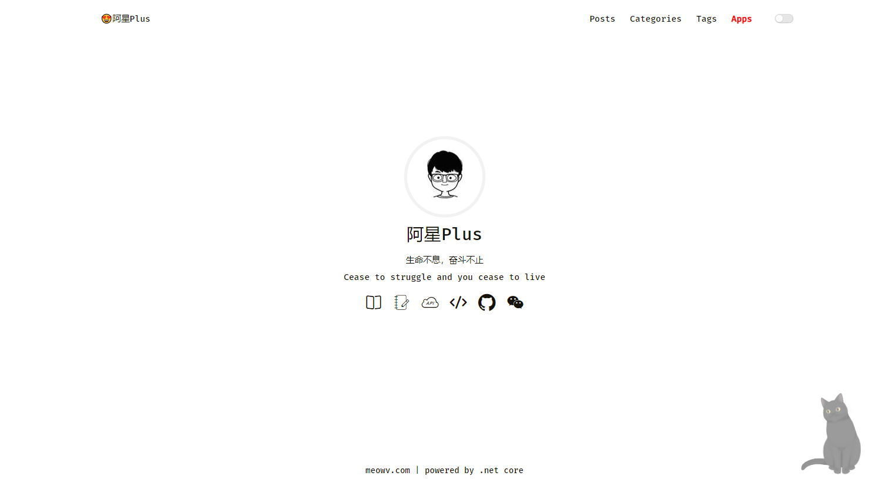
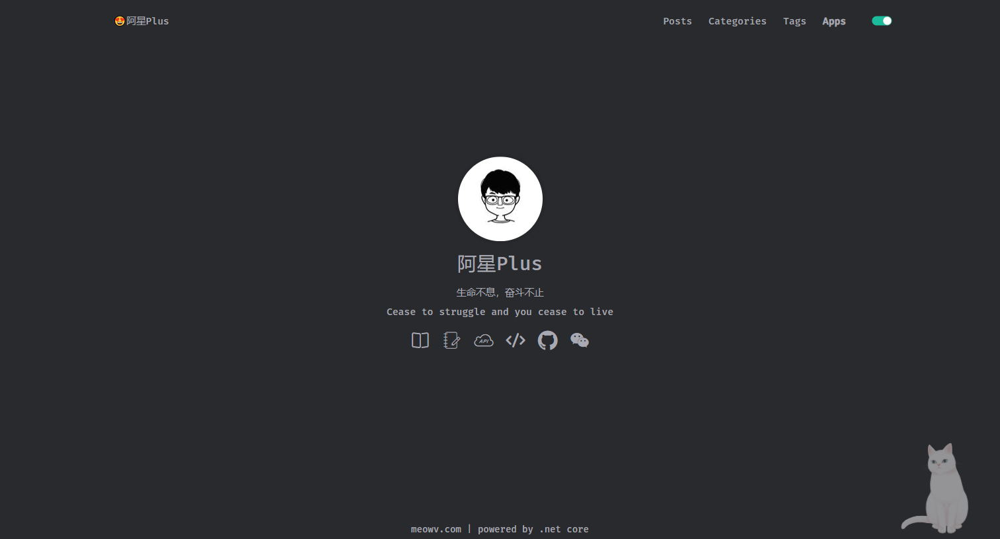

# 😍阿星Plus⭐⭐⭐

## Intro

预览：[https://meowv.com](https://meowv.com)

此版本个人博客项目基于 .NET Core3.1 开发，可作为 .NET Core 入门项目进行学习，数据库采用 Sqlite，遵循RESTful API接口规范，所有页面采用 axios 和 template-web.js 请求和加载数据，原生JavaScript操作页面。If you liked `Blog` project or if it helped you, please give a star ⭐️ for this repository. 👍👍👍

## 技术栈

- 后端：.NET Core 3.1 + Sqlite + WebApi + EF Core + Swagger
- 前端：axios + JavaScript + Json

## 快速体验

- 下载最新的 [Releases](https://github.com/Meowv/Blog/releases/latest) 包
- `dotnet run MeowvBlog.Web.dll`
- 浏览器打开 http://127.0.0.1:5001/ 即可查看效果

## TODO

- [x] 基于 .Net Core 3.1 搭建纯原生开发项目，无第三方框架依赖
- [x] 项目配置，集成 Swagger 管理 API
- [x] 自定义 Swagger 扩展
- [x] Code First 模式开发
- [x] 图片合并处理，添加水印
- [x] 读取操作JSON文件
- [x] 将枚举类型转换为List通用扩展方法
- [x] API 分组
- [x] API 基于 JWT模式授权验证
- [x] Filter 之 Swagger 标签描述
- [x] 使用 Sqlite 数据库
- [x] 使用 EntityFrameworkCore.Sqlite 处理数据
- [x] 核心功能API接口
- [x] 接入第三方登录,GitHub
- [x] 前台界面展示
- [x] 博客核心页面：文章列表、文章详情、分类、标签、分类下的文章列表、标签下的文章列表、友情链接
- [x] 博客小应用页面：吐个槽、个性艺术签名设计、每日热点、随机猫咪图、每日壁纸、访问数据分析
- [x] 据导入 MySQL 至 Sqlite
- [x] 免费生成个性艺术签名API
- [x] Python抓取各大热门网站热门头条，每日热点API，界面展示
- [x] 随机一张猫咪图API
- [x] 微软Bing壁纸抓取，提供API接口
- [x] MTA网站数据分析
- [x] 博客后台管理，文章、标签、分类相关的新增编辑删除
- [x] 瀑布流个人图集相册，添加图集、添加图集对应的图片
- [x] 基于百度AI语音合成算法，识别用户所在地区生成带有经典语录的问候词音频API
- [x] 毒鸡汤语录
- [x] 随机妹子图API和页面
- [x] 程序员版2048游戏
- [x] 在线听歌，支持本地缓存
- [x] 在线听歌，支持播放列表记忆功能
- [x] 在线听歌，刷新页面不中断歌曲播放
- [x] 使用 SignalR 技术和支持 Notification 的浏览器实现消息推送功能
- [x] 腾讯云CDN服务接口化，通过API刷新CDN缓存和刷线历史查询
- [x] 智能抠图，移除图片背景
- [x] 腾讯云验证码防水墙接入，防止频繁调用签名页面
- [x] 手机壁纸，按分类查询，上下页翻页查看，支持点击查看大图
- [x] 基于BackgroundService的简易后台定时任务
- [x] PuppeteerSharp访问指定网页并生成图片
- [x] 基于MailKit和MimeKit发送邮件
- [ ] ...

## Versions

- [v_1.0.0](https://github.com/Meowv/Blog/tree/v_1.0.0)
- [v_2.0.0](https://github.com/Meowv/Blog/tree/v_2.0.0)
- [v_3.0.0](https://github.com/Meowv/Blog/tree/v_3.0.0)
- [v_3.0.1](https://github.com/Meowv/Blog/tree/v_3.0.1)
- [v_3.0.x](https://github.com/Meowv/Blog/tree/v_3.0.x)
- [master](https://github.com/Meowv/Blog)

## Nuget Packages

|Package|Status|
|:------|:-----:|
|Baidu.AI||
|IP2Region||
|MailKit||
|MimeKit||
|PuppeteerSharp||
|SixLabors.ImageSharp||
|SixLabors.ImageSharp.Drawing||
|Swashbuckle.AspNetCore||
|Swashbuckle.AspNetCore.Filters||
|Microsoft.AspNetCore.Authentication.JwtBearer||
|Microsoft.Extensions.Configuration||
|Microsoft.Extensions.Configuration.FileExtensions||
|Microsoft.Extensions.Configuration.Json||
|Microsoft.EntityFrameworkCore.Sqlite||
|Microsoft.EntityFrameworkCore.Tools ||
|Microsoft.EntityFrameworkCore.Design||
|TencentCloudSDK||

## LICENSE

This project is licensed under [MIT](LICENSE).