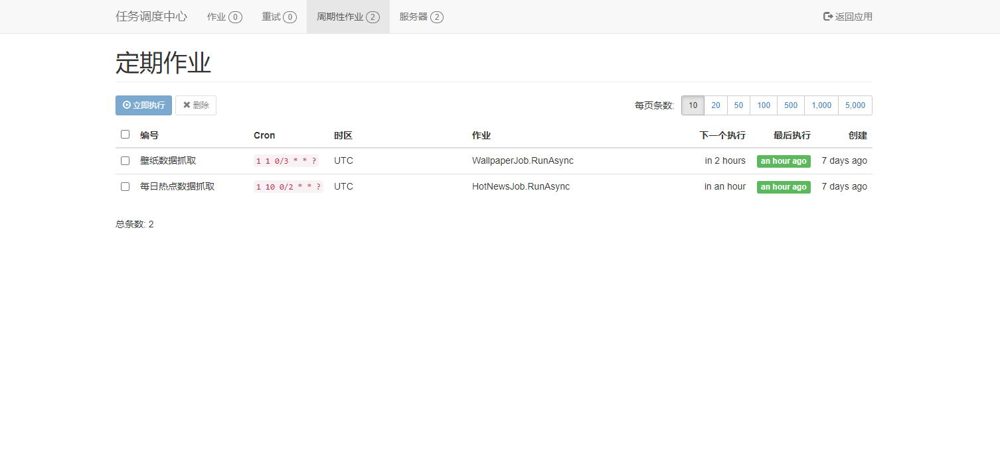

# 😍阿星Plus⭐⭐⭐

## 项目介绍

此版本个人博客项目底层基于 [ABP Framework](http://abp.io/) (不完全依赖)搭建项目 和免费开源跨平台的 .NET Core 3.1 开发，可作为 .NET Core 入门项目进行学习，支持各种主流数据库(SqlServer、MySQL、PostgreSql、Sqlite)，接口遵循 RESTful API 接口规范，前端所有页面采用 axios 和 template-web.js 请求和加载数据，原生JavaScript操作页面。

If you liked `Blog` project or if it helped you, please give a star ⭐️ for this repository. 👍👍👍

```tree
Blog ---------- root
 ├── .dockerignore ---------- docker ignore
 ├── .gitattributes ---------- git attributes
 ├── .gitignore ---------- git ignore
 ├── common.props ---------- common.props
 ├── LICENSE ---------- LICENSE
 ├── Meowv.Blog.sln ---------- Solution
 ├── README.md ---------- README.md
 ├── .github ---------- github config
 ├── src
 │   ├── Meowv.Blog.Application ---------- 应用服务层
 │   ├── Meowv.Blog.Application.Caching ---------- 应用服务缓存
 │   ├── Meowv.Blog.Application.Contracts ---------- 应用服务数据传输对象(DTO)
 │   ├── Meowv.Blog.BackgroundJobs ---------- 后台定时任务
 │   ├── Meowv.Blog.Domain ---------- 领域层，实体，仓储接口
 │   ├── Meowv.Blog.Domain.Shared ---------- 领域层，一些常量，枚举等
 │   ├── Meowv.Blog.EntityFrameworkCore ---------- 集成EF Core，仓储接口实现
 │   ├── Meowv.Blog.EntityFrameworkCore.DbMigrations ---------- EF Core数据库迁移
 │   ├── Meowv.Blog.HttpApi ---------- API控制器
 │   ├── Meowv.Blog.HttpApi.Hosting ---------- WebApi项目，依赖于HttpApi，
 │   ├── Meowv.Blog.Swagger ---------- Swagger扩展、Filter
 │   └── Meowv.Blog.ToolKits ---------- 公共的工具类、扩展方法
 └── static ---------- 用于README.md展示图片的图片文件夹
```

## 技术栈

ABP Framework + .NET Core 3.1 + Docker + Nginx + Hangfire + MySQL + WebApi + EF Core + Swagger + Hangfire + HtmlAgilityPack + axios + JavaScript + Json + ...

## 预览

### Blog：[https://meowv.com](https://meowv.com)


### API：[https://api.meowv.com](https://api.meowv.com)


### Hangfire：[https://api.meowv.com/hangfire](https://api.meowv.com/hangfire)



## LICENSE

This project is licensed under [MIT](LICENSE).
